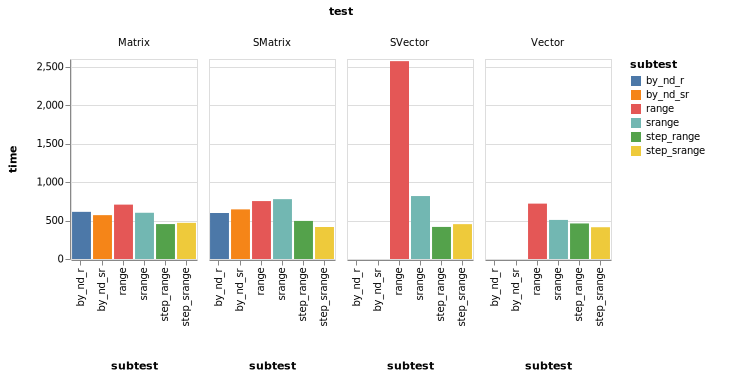

# StaticRanges

[](https://travis-ci.com/Tokazama/StaticRanges.jl) 


## Introduction

StaticRanges is inspired by [StaticArrays](https://github.com/JuliaArrays/StaticArrays.jl).
In its current form StaticRanges aims to be a tool for performant indexing using the strongly
typed `StaticRange`. Current work is focused towards optimizing multidimensional indexing
for a variety of use cases (sliding windows, multidimensional filters, etc.).

## Installation
```julia
]add https://github.com/Tokazama/StaticRanges.jl
```
<!--
## Performance

Note: time is in nanoseconds


-->
